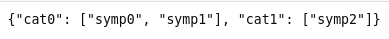

# Project Online Doctor
## Symptom-Disease-Doctor Data Service
### Tasklist:
- [x] Модели БД
- [x] API для выдачи списков симптомов по категориям в виде JSON
- [x] API для обработки вариантов отправленных пользователем

## Описание

По адресу`<HOST>/sdd-data-service/index` приложение возвращает JSON вида `{<КАТЕГОРИЯ>:[<СИМПТОМ>,...,<СИМПТОМ>],...}`. Пример:

По адресу`<HOST>/sdd-data-service/odapi` приложение получает (при запросе POST) JSON вида `{'slist':[<СИМПТОМ>, <СИМПТОМ>, ..., <СИМПТОМ>]}` и отдаёт JSON вида `{'dlist':[<ДОКТОР>, <ДОКТОР>, ..., <ДОКТОР>]}`.

Адрес администрации `<HOST>/admin`.